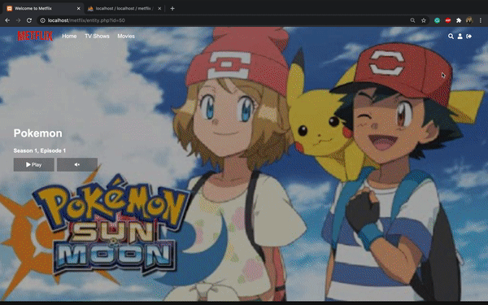
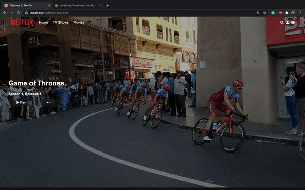

# netflix-clone-project
Use **JavaScript**, **PHP** and **MySQL** to make the ultimate Netflix clone website completely from scratch.

This Metflix clone includes the features:
- User registration/login
- Movie streaming
- TV Show streaming
- Live search system
- Paypal integration for **paid accounts**

PHP development environment:
- [XAMPP](https://www.apachefriends.org/index.html)

Paypal integration:
- [Paypal SDK](https://github.com/paypal/PayPal-PHP-SDK/releases)
- [Paypal billing plan](https://developer.paypal.com/developer/applications/edit/SB:QWJGblJZU1JkSF9obi1xVWVPRlA4MFpnTUJGbHN0T3hNaHdzLXZVZWtRcHEyVUx1WnRlVm90al83Y3ByeEVNZHdrSHJKWGdvVGVNUjRpNm4=)

## 1. Login to Metflix
Store the user details in phpmyadmin. Show all categories after login to metflix.

## 2. Record and show all series and episode
Update the watching progress of the user and marked the watched video. Added the function which can continue watch the next episode of that series.

## 3. Enable search feature
Search for related video name after 500 ms based on the keyin characters.

## 4. Embedded Paypal subscription feature
Create the Paypal billing plan through [developer paypal api](https://developer.paypal.com/docs/api/overview/).

